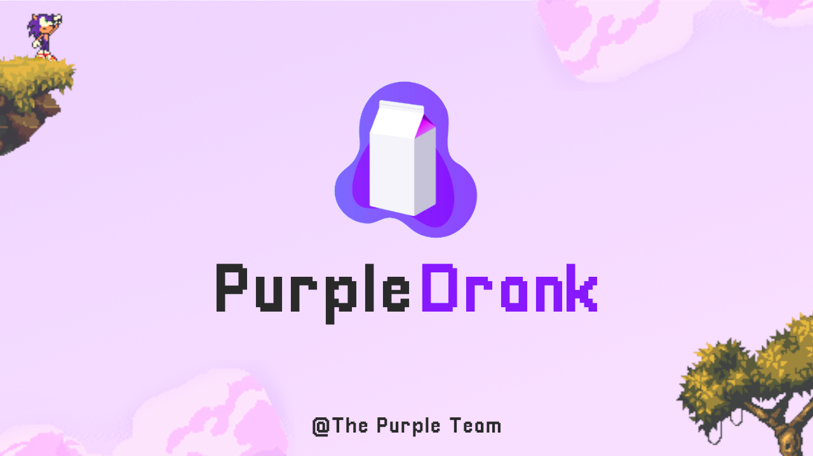

[](https://discord.com/login)

# PurpleDrank
A *rage-proof*, and *pixel-perfect* jump game, powered by Raylib framework.
The main character is a remake of Sonic, named Solin, refering to the *Lean* which is the in-game resource.



## Story :fr:
*Solin et son Ekip*

Le monde de Lealle est attaqué par un virus mortel, la fièvre Ebolean, causée par le Gob-Lean lorsqu'il se fit quitter par sa copean. Cette rage se fit ressenti lors d'orages violets, les purple rain, rendant le monde accroc à cette substance qu'est la lean.

Dans le monde chaotique de Lealle, vous aiderez Solin et son Ekip, à vaincre leur ennemi juré, à travers une aventure et des mini-jeux d'enfer!

**Récupérer un maximum de seaux de Cristalean afin de pouvoir vaincre le Gob-Lean!**

## Installation :joystick:
To install and play this game, please run the following:
```
sudo apt install -y git
git clone http://gvipers.imt-lille-douai.fr/fatus/purple-drank-2020/purple-drank.git PurpleDrank
cd PurpleDrank && make
./PurpleDrank

# To install permanently
sudo make install

# To uninstall, removing all game files
sudo make uninstall
```

## Gameflow
PurpleDrank's adventure mode is made of **5 levels** and **1 bonus stage**. A boss can be met in the third and fifth levels. Don't worry if you do not succeed, you're maybe not good enough yet ;)

PurpleDrank also includes minigames to train your ability for the adventure mode.

## Controls
The default game controls are listed below, we wanted to go pro and present a customizable controls screen, but you know, kids, family...

| Keys | Description |
|:-:|-|
| `ESC` | Exit the game |
| `ENTER` | Confirm selection and skip screens/dialogs |
| `LEFT`<br>`UP`<br>`RIGHT`  | Controls player's movements |
| `SPACE` | Interact with the launchpad/Use the JetLean |
| `R` | Player "super" mode (ball, faster) |
| `Q` | Throw lean (when possible) |
| `W` | Enable the JetLean (when possible) |
| `E` | Generate portals (when possible) |
| `G` | Enable Gelano mode (to stop ice-slipping) |
| `F1` | Return to the menu (game resets) |
| `F3` | Toggle debug mode |

## Contribution :pencil2:
For contribution instructions, please read this [documentation](src/README.md)

To see the overall features we worked on and those we're implementing, check the [TODO](TODO.md)

To see the list of the contributors and their assignements, read the [PROJECT-OUTLINE.md](PROJECT-OUTLINE.md)

## Credits
**@** The Purple Team 

(*The project is open source, licensed under [MIT License](https://en.wikipedia.org/wiki/MIT_License)*)
